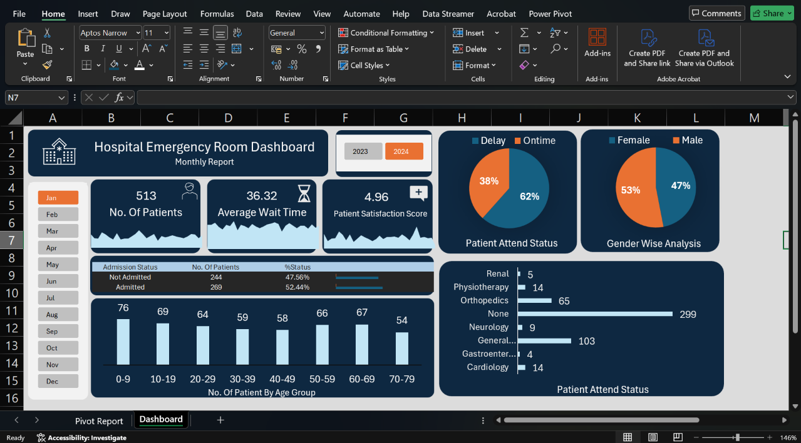

# 🏥 Hospital Emergency Room Dashboard

An interactive Excel dashboard designed to analyze hospital emergency room data and provide insights into patient volume, waiting time, satisfaction, admission status, demographics, and attendance patterns.

## 📊 Dashboard Preview

---

## 📌 Project Overview

This project analyzes hospital emergency room data using Microsoft Excel.

The dashboard provides an interactive monthly view of emergency room activity and allows users to analyze key patient metrics based on different months and years.

The analysis focuses on:

- Patient volume
- Average patient waiting time
- Patient satisfaction
- Admission status
- Patient attendance status
- Gender distribution
- Age-group distribution
- Department/medical specialty distribution

---

## 🎯 Objectives

The main objectives of this project are:

1. Analyze the number of patients visiting the emergency room.
2. Measure average patient waiting time.
3. Analyze patient satisfaction scores.
4. Compare admitted and non-admitted patients.
5. Analyze patient demographics.
6. Understand patient attendance patterns.
7. Create an interactive dashboard for quick decision-making.

---

## 🛠️ Tools & Technologies

- Microsoft Excel
- Pivot Tables
- Pivot Charts
- Slicers
- Data Cleaning
- Data Analysis
- Dashboard Design
- Data Visualization

---

## 📈 Key Dashboard Metrics

The dashboard provides several important KPIs:

### Patient Volume

Displays the total number of patients during the selected period.

### Average Wait Time

Shows the average amount of time patients waited before receiving care.

### Patient Satisfaction

Displays the average patient satisfaction score.

### Admission Status

Compares patients who were admitted with those who were not admitted.

### Patient Attendance Status

Analyzes the proportion of patients who were delayed versus attended on time.

### Gender Analysis

Provides a comparison between male and female patients.

### Age Group Analysis

Analyzes patient distribution across different age groups.

### Medical Specialty

Shows the number of patients associated with different medical specialties.

---

## 📊 Dashboard Features

The dashboard includes:

- Monthly filters
- Year selection
- KPI cards
- Pivot tables
- Pivot charts
- Slicers
- Interactive visualizations
- Demographic analysis
- Admission analysis
- Patient attendance analysis

---

## 🔍 Analysis Performed

The project uses Excel Pivot Tables to summarize the underlying hospital data.

The dashboard then converts these summaries into visualizations that make it easier to identify:

- Patient volume patterns
- Waiting-time trends
- Admission distribution
- Demographic patterns
- Patient attendance patterns
- Medical specialty distribution

---
